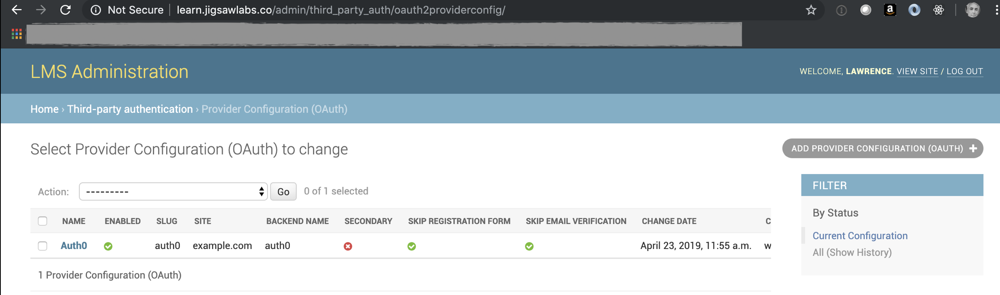
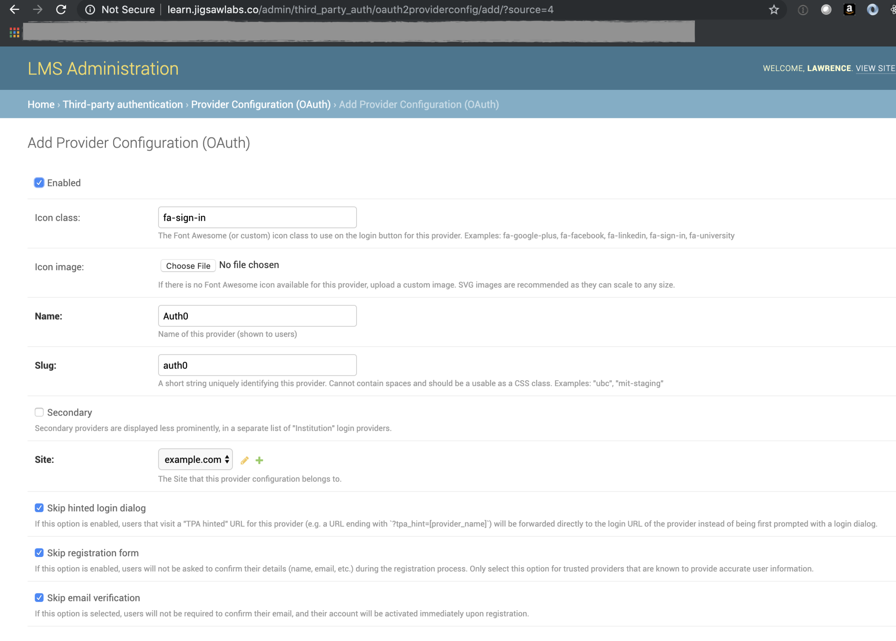

Auth0 OAuth2 Backend
=============================

Overview
--------

A Python Social Auth backend for Auth0, mostly used for Open edX but can be used elsewhere.
This package was originally cloned from https://github.com/appsembler/trinity-oauth-backend.

This package is structured so that it can be uploaded to PyPI and installed using pip or easyinstall.
More detail here: https://python-packaging.readthedocs.io/en/latest/minimal.html

Installation
--------
The high-level installation process exactly follows the Open edX documentation: Link: https://edx.readthedocs.io/projects/edx-installing-configuring-and-running/en/latest/configuration/tpa/tpa_integrate_open/tpa_oauth.html

**1. Install this repo to an Open edX installation using pip**

::

    sudo -H -u edxapp bash
    source /edx/app/edxapp/edxapp_env
    /edx/bin/pip.edxapp install --upgrade git+https://github.com/jigsaw-labs/edx.oauth.git

    # Verify that installation was successful.
    # Look for pip package: edx-oauth-Auth0 (0.1.0)
    pip list installed

This package can alternatively be installed directly from its github repo using syntax as follows:

::

    setup(
    ...
      dependency_links=['https://github.com/jigsaw-labs/edx.oauth.git']
    ...
    )

**2. Register the pip package in /edx/app/edxapp/lms.env.json**

::

  "THIRD_PARTY_AUTH_BACKENDS": [
            "jigsawlabs_backends.auth0.Auth0OAuth2"
        ]

**3. Add configuration parameters to /edx/app/edxapp/lms.env.json**

::

  "AUTH0_BACKEND_CLIENT_ID" : "081b8d1---> AN EXAMPLE KEY ---->081b8d11d991702e4dc9f5c928e3d53e",
  "AUTH0_BACKEND_CLIENT_SECRET" : "123456789---> AN EXAMPLE SECRET ---->d16df7396bd16df7396bd16df7",
  "AUTH0_BACKEND_BASE_URL" : "https://associationdatabase.com",
  "AUTH0_BACKEND_USER_QUERY" : "/api/user?",

**4. Set Open edX LMS app feature flags in /edx/app/edxapp/lms.env.json**

::

  "FEATURES" : {
      ...
      "ENABLE_COMBINED_LOGIN_REGISTRATION": true,
      "ENABLE_THIRD_PARTY_AUTH": true
  }

**5. Add Python constants to  /edx/app/edxapp/edx-platform/lms/envs/aws.py**

::

  AUTH0_BACKEND_CLIENT_ID = ENV_TOKENS.get('AUTH0_BACKEND_CLIENT_ID', None)
  AUTH0_BACKEND_CLIENT_SECRET = ENV_TOKENS.get('AUTH0_BACKEND_CLIENT_SECRET', None)
  AUTH0_BACKEND_BASE_URL = ENV_TOKENS.get('AUTH0_BACKEND_BASE_URL', 'https://associationdatabase.com')
  AUTH0_BACKEND_USER_QUERY = ENV_TOKENS.get('AUTH0_BACKEND_USER_QUERY', '/api/user?')

**6. Register a Third Party Authorization configuration profile in Django Admin**

Refer to instructions in edx.readthedocs.io "4.22.3.2.1.1.3. Add the Provider Configuration" on configuring this oAuth consumer. This is a simple form for configuring the appearance of the button face on the login and registration forms on the LMS and AM.

Django model configuration: <LMS URI>/admin/third_party_auth/oauth2providerconfig/

Identity Provider System (https://associationdatabase.com)
--------
For this module to work it is first necessary to create an oauth application on the Identity Provider system associationdatabase.com.
Key contacts for this platform are:
  - David Zachrich dave@tcssoftware.com
  - Tim Rorris tim@tcssoftware.com
For reference, the current settings are as follows.

.. image:: docs/associationdatabase.com-oauth-app.png

SSO Endpoints
-------------
The backend consumes the following URLs:

-  **User Query** ``https://associationdatabase.com/api/user?``
-  **Registration:** ``https://associationdatabase.com/register``
-  **Login:** ``DO NOT YET HAVE THIS VALUE.``
-  ``AUTHORIZATION_URL``:
   ``https://associationdatabase.com/oauth/authorize``
-  ``ACCESS_TOKEN_URL``:
   ``https://associationdatabase.com/oauth/token``

The OAuth server provides the following information about the user:

- ``email``
- ``username``
- ``first_name``
- ``last_name``
- ``full_name``

License
-------

The code in this repository is licensed under the MIT License unless
otherwise noted.

Please see ``LICENSE.txt`` for details.

The Backend Dependency on Python Social Auth
--------------------------------------------

The backend depends on Python Social Auth. It is only compatible with the
`new split Python Social Auth
<https://github.com/python-social-auth/>`_
that is being used on Ginkgo and upcoming releases.
